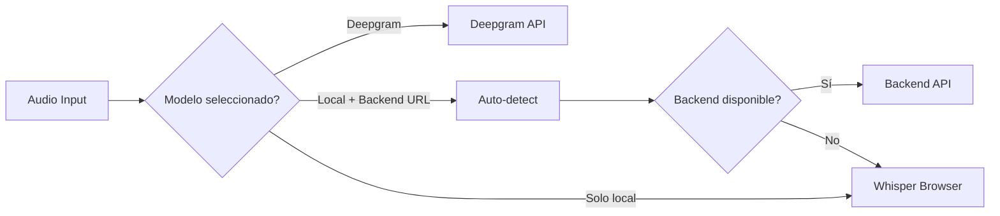

# 🚀 Multi-Backend Setup para Susurro

## Configuración completada ✅

Tu proyecto ahora soporta múltiples backends de transcripción:

### Backends disponibles:
1. **Cliente (Browser)** - Whisper ejecutándose en el navegador
2. **Backend local** - API Python con faster-whisper
3. **Deepgram** - API cloud de alta precisión

## 🎯 Cómo usar

### 1. Desarrollo con backend local automático

```bash
# Inicia todo automáticamente (frontend + backend)
npm run dev

# O sin backend (solo frontend)
npm run dev:no-backend
```

El backend Python se levanta automáticamente en `http://localhost:8000`

### 2. Seleccionar el backend

Al iniciar la app:
- **Modelos locales** (tiny, base, small, medium, large) → Usan Whisper en el navegador
- **Deepgram Nova-2** → Usa la API de Deepgram (requiere API key)
- **Con VITE_WHISPER_BACKEND_URL configurado** → Auto-detecta y usa el backend si está disponible

### 3. Configuración de variables de entorno

Crea un archivo `.env.local`:

```env
# Backend local de Whisper
VITE_WHISPER_BACKEND_URL=http://localhost:8000

# Para Deepgram (opcional)
VITE_DEEPGRAM_API_KEY=tu_api_key_aqui

# Forzar método (opcional)
VITE_FORCE_BACKEND=false
VITE_FORCE_CLIENT=false
```

## 📊 Indicador de estado

En la esquina superior derecha verás:
- 🟢 **Verde**: Backend online
- 🔴 **Rojo**: Backend offline
- 🟡 **Amarillo**: Verificando conexión

## 🔄 Flujo de transcripción



## 🛠️ Arquitectura

### Frontend (React)
- **EnhancedWhisperProvider**: Maneja múltiples backends
- **BackendStatus**: Muestra estado de conexión
- **ModelSelector**: Permite elegir modelo/backend

### Backend (Python/FastAPI)
- **main.py**: API REST con faster-whisper
- **Auto-start**: Se levanta con `npm run dev`
- **CORS**: Configurado para desarrollo local

### Deepgram Integration
- **backend-deepgram.ts**: Cliente WebSocket para Deepgram
- **Streaming**: Soporte para transcripción en tiempo real
- **Fallback**: Si falla, usa cliente o backend local

## 📝 Notas importantes

1. **El backend se inicia automáticamente** con `npm run dev`
2. **Deepgram requiere API key** - Obtén una en https://console.deepgram.com
3. **Fallback automático**: Si un backend falla, usa el siguiente disponible
4. **Hot reload**: Cambios en backend se reflejan automáticamente

## 🔍 Debug

Para ver logs detallados:
```javascript
localStorage.setItem('susurro-debug', 'true');
```

Ver estado del backend:
```javascript
// En la consola del navegador
console.log(window.__SUSURRO_BACKEND_STATUS__);
```

## 🚦 Testing

```bash
# Test backend local
curl http://localhost:8000/health

# Test transcripción
curl -X POST http://localhost:8000/transcribe \
  -F "audio=@public/sample.wav" \
  -F "language=en"
```

## 📚 Referencias

- [Backend Integration Guide](./BACKEND_INTEGRATION.md)
- [Backend README](./backend/README.md)
- [Deployment Guide](./backend/DEPLOYMENT.md)